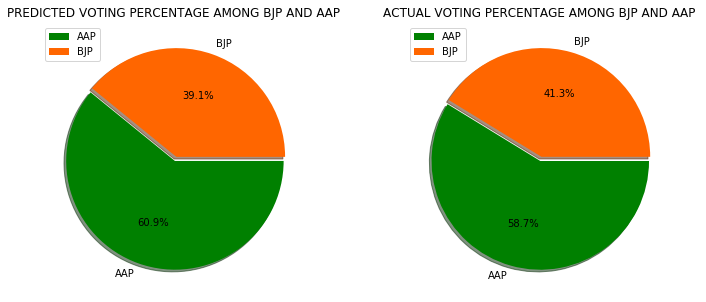

# Delhi Election Web Poll 2020 using sentiment analysis of twitter comments  
## Overview
* `Devloped a Machine learning model which able to predict the voting percentage of parties via Sentiment Analysis of tweets.`
* `Data has been collected with the help of twitter api ” tweepy ” using only tags AAP ,BJP , CONGRESS to avoid biases and complexity and Data is collected only region which is within 20km area circle from Delhi Central.`
* `Result able to show the right order of voting percentage but they are little bit off from the actual
voting percentage(Actual=54,37,8 Predicted=44,30,24) . I also have done the interpretation why it might be happend in result section.`

## Dataset:

#### Data Collection
 
Data has been collected with the help of twitter api tweepy , Just like all api's you need to register for twitter developer account.So during data collection i used coordinate based functionlatiy(geocode) to access the location of tweets.I have used <b> gecode=(28.644800,77.216721) </b> as center with radius of 20km around it.Apart from that AAP,BJP,CONGRESS keyword used during query for not getting too complex by using a variety of keywords.

#### Data Cleaning and Pre-processing
Tweepy return results with a lot of atrributes such timestamp,tweets,contributors,hashtags etc... So First we fetch the tweet alone but even in tweet there is a lot of uncessary things like @ ,urls etc.. we remove them by simple textual processsing.

### All the data used for analysis was taken from the timeline before any Results announced or Exit poll published so that it doesn't affected by any media biasis or actula result .  

## Sentiment Analysis

For doing Sentiment analysis i used textblob library which provides function TextBolb to get the polarity of sentence or tweet on the basis of that you can decide whether it is positive,neutral or negative sentiment oriented tweet.After that i simply calculated the positive to negative sentiment ratio , then we caculated the voting percentage by their relative ratio.

## RESULTS
Texblob have hard time counter sarcasm and other contextual related infromation. 
So when we compare main two competing parties voting percentage was pretty close to actual results.   

 

 
But when we move to all parties the result shattered a little bit , it was predicting pretty high for clearly losing party due to the fact that there isn't a lot of talk about that party and due to which a lot people don't have any negative sentiments against it because there is no discussion going around it , if there was those generally have sarcastic comments on it which model textblob doesn't able to recognize.   

